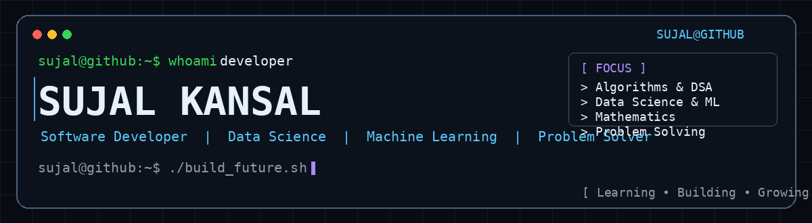

<!-- =========================
     TERMINAL HEADER
========================= -->

<p align="center">
  
</p>

<!-- =========================
     PROFILE METRICS
========================= -->

<p align="center">

  <a href="https://github.com/Sujalkan07">
    
  </a>

  <a href="https://github.com/Sujalkan07">
    
  </a>

  

</p>

<p align="center">

  <a href="https://leetcode.com/sujalkan07">
    
  </a>

  <a href="https://www.linkedin.com/in/sujal-kansal-8a058a303/">
    
  </a>

  <a href="mailto:sujalkansal477@gmail.com">
    
  </a>

</p>

---

<h2>👨‍💻 About Me</h2>

<p>
I'm a <strong>Software Developer</strong> currently expanding my skills into
<strong>Data Science and Machine Learning</strong>.
</p>

<p>
I enjoy solving algorithmic problems, strengthening my mathematical
foundations, and building practical projects that combine
<strong>software engineering, data, and machine learning</strong>.
</p>

<br>

<h3>🚀 Currently</h3>

<table>
<tr>
<td width="55">

🔭

</td>
<td>

<strong>Working on</strong><br>
DSA and Data Science projects

</td>
</tr>

<tr>
<td>

🌱

</td>
<td>

<strong>Learning</strong><br>
Python, Data Science, Machine Learning, Mathematics for ML and DSA

</td>
</tr>

<tr>
<td>

🧠

</td>
<td>

<strong>Strengthening</strong><br>
Algorithms, Data Structures, Mathematics and Problem Solving

</td>
</tr>

<tr>
<td>

🤝

</td>
<td>

<strong>Open to collaborating on</strong><br>
Open Source, Software Engineering and Data Science projects

</td>
</tr>

<tr>
<td>

💡

</td>
<td>

<strong>Interested in</strong><br>
Building practical and scalable solutions

</td>
</tr>

</table>

<br>

<h3>💬 Ask Me About</h3>

<p>
  
  
  
  
  
  
</p>

---

<h2>🛠️ Languages & Tools</h2>

<p align="center">

  

</p>

<p align="center">

  
  
  
  
  
  

</p>

---

<h2>⚡ Current Focus</h2>

<table>
<tr>

<td align="center" width="25%">

### 💻 DSA

Algorithms<br>
Data Structures<br>
Problem Solving

</td>

<td align="center" width="25%">

### 📐 Mathematics

Linear Algebra<br>
Probability<br>
Statistics

</td>

<td align="center" width="25%">

### 🤖 Machine Learning

ML Algorithms<br>
Model Building<br>
Evaluation

</td>

<td align="center" width="25%">

### 📊 Data Science

Python<br>
Data Analysis<br>
Visualization

</td>

</tr>
</table>

---

<h2>🔥 Contribution Streak</h2>

<p align="center">
  
</p>

---

<h2>🐍 Contribution Snake</h2>

<p align="center">
  <picture>

    <source
      media="(prefers-color-scheme: dark)"
      srcset="https://raw.githubusercontent.com/Sujalkan07/Sujalkan07/output/github-contribution-grid-snake-dark.svg"
    />

    <source
      media="(prefers-color-scheme: light)"
      srcset="https://raw.githubusercontent.com/Sujalkan07/Sujalkan07/output/github-contribution-grid-snake.svg"
    />

    

  </picture>
</p>

---

<h2>📌 Featured Projects</h2>

<table>
<tr>

<td width="50%" valign="top">

<h3>🧠 DSA — LeetCode</h3>

<p>
A growing collection of my <strong>Data Structures & Algorithms</strong>
practice and LeetCode solutions.
</p>

<h4>Focus Areas</h4>

<p>


</p>

<p>
  <a href="https://github.com/Sujalkan07/DSA---LeetCode">
    
  </a>
</p>

</td>

<td width="50%" valign="top">

<h3>📊 Data Science & ML</h3>

<p>
A growing collection of projects as I move deeper into
<strong>Data Science and Machine Learning</strong>.
</p>

<h4>Current Focus</h4>

<p>


</p>

<p>
  <a href="https://github.com/Sujalkan07">
    
  </a>
</p>

</td>

</tr>
</table>

---

<h2>🧮 My Learning Journey</h2>

<table>
<tr>

<td align="center">

<strong>SOFTWARE DEVELOPMENT</strong><br>
↓<br>
DSA<br>
Problem Solving<br>
Software Engineering

</td>

<td align="center">

<strong>MATHEMATICS</strong><br>
↓<br>
Statistics<br>
Linear Algebra<br>
Probability

</td>

<td align="center">

<strong>MACHINE LEARNING</strong><br>
↓<br>
ML Algorithms<br>
Model Building<br>
Evaluation

</td>

<td align="center">

<strong>DATA SCIENCE</strong><br>
↓<br>
Python<br>
Data Analysis<br>
Visualization

</td>

</tr>
</table>

---

<h2>🎯 Goals</h2>

<table>
<tr>
<td>

✅ Build strong foundations in <strong>DSA and Computer Science</strong>

</td>
</tr>

<tr>
<td>

✅ Become highly comfortable with <strong>Python and Data Science</strong>

</td>
</tr>

<tr>
<td>

✅ Master the <strong>mathematics behind Machine Learning</strong>

</td>
</tr>

<tr>
<td>

✅ Build meaningful <strong>end-to-end Machine Learning projects</strong>

</td>
</tr>

<tr>
<td>

✅ Contribute to <strong>Open Source</strong>

</td>
</tr>

<tr>
<td>

✅ Keep improving my <strong>problem-solving skills</strong>

</td>
</tr>

</table>

---

<h2>🤝 Connect With Me</h2>

<p align="center">

<a href="https://github.com/Sujalkan07">
  
</a>

<a href="https://www.linkedin.com/in/sujal-kansal-8a058a303/">
  
</a>

<a href="https://leetcode.com/sujalkan07">
  
</a>

<a href="mailto:sujalkansal477@gmail.com">
  
</a>

</p>

---

<p align="center">

```text
sujal@github:~$ echo "Learn • Build • Solve • Repeat"
