 

  

 

## 👤 About Me

I'm a **Software Developer** currently expanding my skills into **Data Science** and **Machine Learning**.
I enjoy solving algorithmic problems, strengthening my mathematical foundations, and building practical projects that combine software engineering, data, and machine learning.

## 🚀 Currently

- 🔭 **Working on** DSA and Data Science projects
- 🌱 **Learning** Python, Data Science, Machine Learning, Mathematics for ML and DSA
- 🧪 **Strengthening** my foundations in Algorithms, Data Structures, Mathematics and Problem Solving
- 🤝 **Open to collaborating** on Open Source, Software Engineering and Data Science projects
- 💡 **Interested in** building practical and scalable solutions

## 💬 Ask Me About

## 🛠️ Languages & Tools

## 🔥 Contribution Streak

## 🐍 Contribution Snake

## 📌 Featured Projects

<table>
<tr>
<td width="160">

</td>
<td>

**📊 Data Science & ML**
A growing collection of projects as I move deeper into Data Science and Machine Learning.

_Current Focus:_

</td>
</tr>
</table>

## 📊 GitHub Stats

